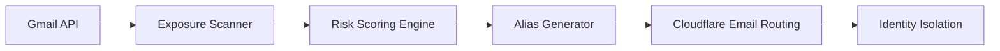

# Cloud Identity Attack Surface Scanner

Cloud-native security tool that discovers where an identity is exposed across SaaS platforms, ranks risk, and generates compartmentalized email aliases to reduce account takeover blast radius.



## Why this exists

Email identity is the primary pivot point in modern account takeover.  
This project demonstrates how to:

- Discover identity exposure using Gmail API
- Rank exposure risk using security-focused scoring
- Generate isolated aliases using a custom domain
- Reduce attack surface and improve identity compartmentalization
- Deploy securely using containerization and cloud IAM principles

This mirrors real-world SaaS and cloud identity protection workflows.

---

## Architecture

**Data Flow**

Gmail API → Exposure Scanner → Risk Scoring Engine → Alias Generator → Security Actions

**Components**

| Component | Function |
|---|---|
| gmail_scanner.py | Extracts account exposure from Gmail |
| rank_exposures.py | Scores exposure risk |
| alias_generator.py | Creates compartmentalized aliases |
| notifier.py | Security alert logic |
| Dockerfile | Containerized execution |
| Cloudflare Email Routing | Alias identity isolation |

---

## Example Output

domain,max_risk,recommended_alias
robinhood.com,100,robinhood@corradosec.com

paypal.com,70,paypal@corradosec.com

microsoft.com,85,auth-microsoft@corradosec.com


---

## Security Principles Demonstrated

**Identity Isolation**

Each service uses a unique alias:
service@domain.com


Prevents lateral account takeover.

**Least Privilege**

Gmail API uses read-only scope:
gmail.readonly


**Secret Management**

Sensitive credentials excluded using .gitignore.

**Cloud-Native Design**

Containerized for deployment in:

- Google Cloud Run
- Azure Container Apps
- AWS ECS

---

## Threat Model

**Threat:** Account takeover via exposed primary email

**Attack chain:**

1. Identity exposed in breach
2. Attacker enumerates SaaS accounts
3. Password reset initiated
4. Email takeover → full identity compromise

**Mitigation:**

Alias isolation breaks attack chain.

---

## Skills Demonstrated

Cloud Security Engineering  
IAM Security  
Security Automation  
Python Security Tooling  
OAuth2 Integration  
Attack Surface Management  
Containerization  
Security-Focused Architecture  

---

## Safe Sample Data

See:

sample_output/


Real personal exposure data excluded.

---

## Future Enhancements

- Cloud Run automated scanning
- SIEM integration
- Risk dashboard
- Identity exposure alerting
- Enterprise IAM integration

---

## Quickstart

### Run with Docker

Build container:

```bash
docker build -t identity-scan .
```

Run in demo mode (no credentials required):

```bash
docker run --rm -e DEMO_MODE=1 identity-scan
```

Run with Gmail integration (local secure mode):

```bash
docker run --rm -v "%cd%\secrets:/secrets:ro" -v "%cd%\output:/app/output" -e GMAIL_TOKEN_PATH=/secrets/token.json identity-scan
```

Requires local Gmail API credentials (not included in repository).

---

### Run locally without Docker

Install dependencies:

```bash
pip install -r requirements.txt
```

Run ranking:

```bash
python rank_exposures.py
```

Generate aliases:

```bash
python app/alias_generator.py
```

## Author

Timothy Corrado  
Cybersecurity Professional  

---

## Disclaimer

This project is for defensive security and educational purposes only.
